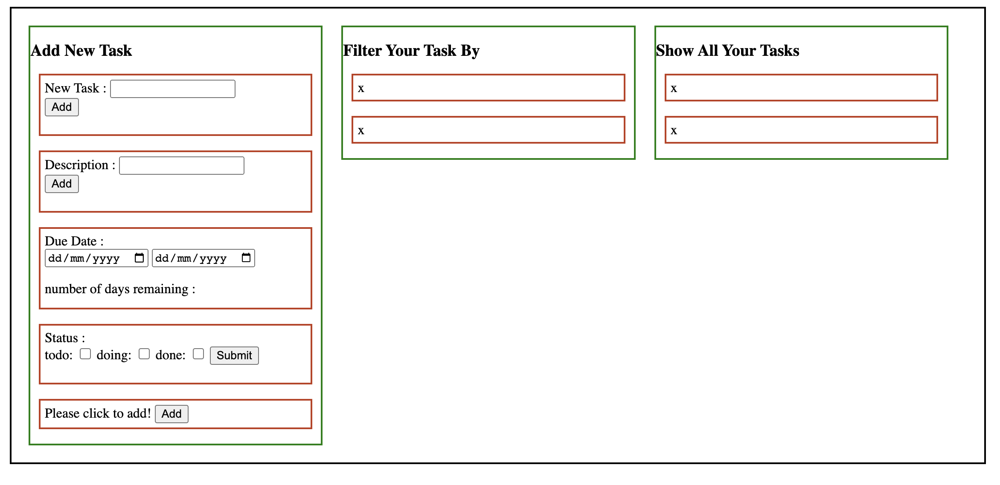

# Project Planner (1-3  November 2022)

>  ## Why was this planner created?
> Wouldn't it be nice to have a tool to manage our projects? Something that would allow us to track the progression of each requirements of our apps.

> ## Completed
> - Allow user to create tasks. Tasks should have a name, a description and a due date
> - Allow users to label their tasks with a status (ex: to do, doing, done)
> - Display the tasks, with their remaining time. For instance, if today is the 15th of March and the task is due for the 20th of March, display in 5 days.
> - Allow users to sort their tasks by remainining time, with the most urgent first, or by name.
> - Filter tasks (ex: only show "to do" tasks)
> - BONUS: Save tasks in LocalStorage, so that they persist even when the page is refreshed.

> ## How I started?
> 
>  - I drew a sketch like this

> ## How's it going?
> 
> - It looks more or less like this right now.
